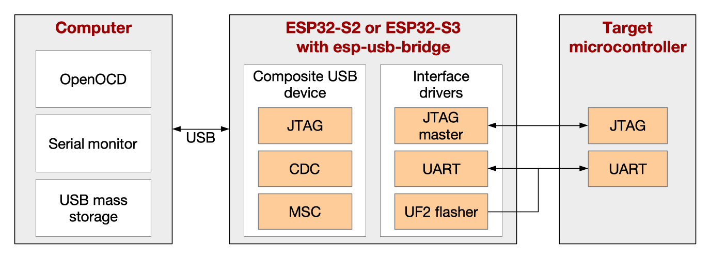

# ESP USB Bridge

The ESP USB Bridge is an [ESP-IDF](https://github.com/espressif/esp-idf) project utilizing an ESP32-S2 (or optionally, an ESP32-S3) chip to create a bridge between a computer (PC) and a target microcontroller (MCU). It can serve as a replacement for USB-to-UART chips (e.g. CP210x).

The concept of ESP USB Bridge is shown in the following figure.



ESP USB Bridge creates a composite USB device accessible from the PC when they are connected through a USB cable. The main features are the following.
- *Serial bridge*: The developer can run [esptool](https://github.com/espressif/esptool) or connect a terminal program to the serial port provided by the USB CDC. The communication is transferred in both directions between the PC and the target MCU through the ESP USB bridge.
- *JTAG bridge*: [openocd-esp32](https://github.com/espressif/openocd-esp32) can be run on the PC which will connect to the ESP USB Bridge. The ESP32-S2 acts again as bridge between the PC and the MCU, and transfers JTAG communication between them in both directions.
- *Mass storage device*: USB Mass storage device is created which can be accessed by a file explorer in the PC. Binaries in UF2 format can be copied to this disk and the ESP32-S2 will use them to flash the target MCU. Currently ESP USB Bridge is capable of flashing various Espressif microcontrollers.

Note that while this file readme files mentions ESP32-S2 chip, this project can also be used on an ESP32-S3.

## How to Compile the Project

[ESP-IDF](https://github.com/espressif/esp-idf) v4.3 or newer can be used to compile the project. Please read the
documentation of ESP-IDF for setting up the environment.

- `idf.py menuconfig` can be used to change the default configuration. The project-specific settings are in the "Bridge Configuration" sub-menu.
- `idf.py build` will build the project binaries.
- `idf.py -p PORT flash monitor` will flash the ESP32-S2 and open the terminal program for monitoring. Please note that PORT is the serial port created by an USB-to-UART chip connected to the serial interface of ESP32-S2 (not the direct USB interface provided by ESP32-S2). This serial connection has to be established only for flashing. The ESP USB Bridge can work through the USB interface after that.

The initial flashing can be done by other means as well as it is pointed out in [this guide](https://docs.espressif.com/projects/esp-idf/en/latest/esp32s2/api-guides/usb-console.html#initial-upload).

## Development Board

A simple development board connecting an ESP32-S2 to an ESP32 serving as target MCU is shown in the [schematics](images/schematics.pdf). The default configurations of the project were tested with this setup.

Similar boards can be manufactured and flashed with the ESP USB Bridge. The pin numbers, vendor and product identifiers and other settings can be changed in `idf.py menuconfig`.

Please note that every board should have its own vendor and product identifiers. There is also a possibility to register a product identifier under the [Espressif vendor identifier](https://github.com/espressif/usb-pids).

## Serial Bridge

The USB stack of ESP USB Bridge creates a virtual serial port through which the serial port of the target MCU is accessible. For example, this port can be `/dev/ttyACMx` or `COMx` depending on the operating system and is different from the PORT used for flashing the ESP USB Bridge.

For example, an ESP32 target MCU can be flashed and monitored with the following commands.
```bash
cd AN_ESP32_PROJECT
idf.py build
idf.py -p /dev/ttyACMx flash monitor
```

Please note that [esptool](https://github.com/espressif/esptool) or any terminal program can connect to the virtual serial port as well.

## JTAG Bridge

The ESP USB Bridge provides a JTAG device. The following command can be used to connect to an ESP32 target MCU.
```bash
idf.py openocd --openocd-commands "-f board/esp32-bridge.cfg"
```

[Openocd-esp32](https://github.com/espressif/openocd-esp32) version v0.11.0-esp32-20211220 or newer can be used as well to achieve the same:
```bash
openocd -f board/esp32-bridge.cfg
```

Please note that the ESP usb bridge protocol has to be selected to communicate with the target MCU. `idf.py openocd` without additional arguments would establish connection with the ESP32-S2 (if the JTAG pins are connected through a USB-to-JTAG bridge to the PC).

You might want to make your own copy of `esp_usb_bridge.cfg` with the appropriate product and vendor identifiers of your custom hardware:
```
adapter driver esp_usb_jtag
espusbjtag vid_pid 0x303a 0x1002
espusbjtag caps_descriptor 0x030A  # string descriptor index:10
```

The JTAG interface might need some additional setup to work. Please consult the [documentation of ESP-IDF](https://docs.espressif.com/projects/esp-idf/en/latest/esp32/api-guides/jtag-debugging/configure-ft2232h-jtag.html) for achieving this.

## Mass Storage Device

A mass storage device will show up in the PC connected to the ESP USB bridge. This can be accessed as any other USB storage disk. Binaries built in [the UF2 format](https://github.com/microsoft/uf2) can be copied to this disk and the ESP32-S2 will flash the target MCU accordingly.

Binary `uf2.bin` will be generated and placed into the `AN_ESP32_PROJECT/build` directory by running the following commands.
```bash
cd AN_ESP32_PROJECT
idf.py uf2
```

## License

The code in this project Copyright 2020-2022 Espressif Systems (Shanghai) Co Ltd., and is licensed under the Apache License Version 2.0. The copy of the license can be found in the [LICENSE](LICENSE) file.


## Contributing

We welcome contributions to this project in the form of bug reports, feature requests and pull requests.

Issue reports and feature requests can be submitted using Github Issues: https://github.com/espressif/esp-usb-bridge/issues. Please check if the issue has already been reported before opening a new one.

Contributions in the form of pull requests should follow ESP-IDF project's [contribution guidelines](https://docs.espressif.com/projects/esp-idf/en/latest/esp32/contribute/index.html). 

Additionally please install [pre-commit](https://pre-commit.com/#install) hooks before committing code:
```bash
pip install pre-commit
pre-commit install
```
